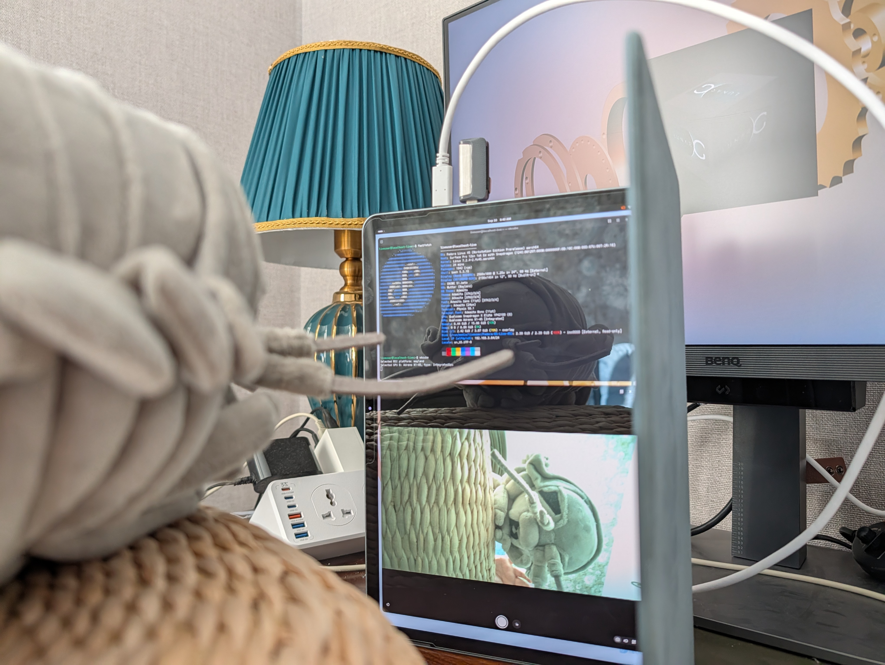
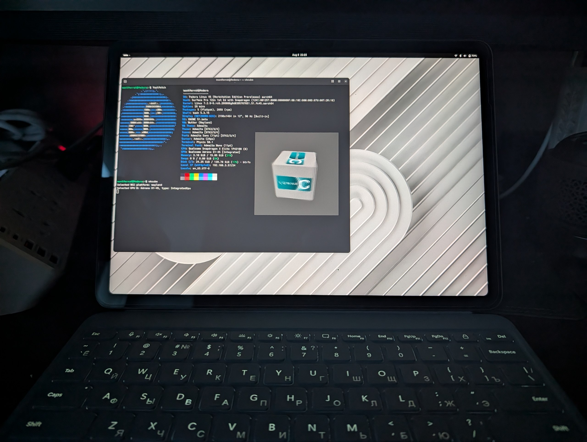

# Fedora KIWI image descriptions, modified to build & launch for Surface Pro 12" Gen 1



**UPD Sep 10 2026:** There has been huge progress made in this project since August! Thanks to kernel patches, pushed onto Linux 7.2 mainstream and [Gentoo overlay](https://github.com/miasvanklei/Gentoo-overlay), most of the previous features which this release lacked (stable suspend on GNOME, accelerometer sensor, dedicated video output, cameras) are now implemented. The project has diverged into [patched kernel](https://sayag.it/fedora-linux-surface-pro-12in/kernel-surface.git) + [libcamera](https://sayag.it/fedora-linux-surface-pro-12in/libcamera.git) builds with an [RPM repo](https://rpm.sayag.it/kernel-sp12in/) publicly available. You can see current state of things in a [feature matrix](#feature-matrix) down below.



It is the fork of the original [KIWI image descriptions](https://forge.fedoraproject.org/releng/kiwi-descriptions), modified for launching Fedora Linux 45 Live ISO on Surface Pro 12" Gen 1 (and further installing it on the device).

I bought this device as I viewed it as a great Linux GNOME tablet, but after several days, many hours of work of trying to do so, I must say that installing a distribution here (and then having it work fine) is a huge pain in the ass.

> Special thanks to [harrisonvanderbyl](https://github.com/harrisonvanderbyl), this project wouldn't be possible without his huge contribution to this whole Linux on Surface ARM business!

## How to run

**The compiled ISOs can be downloaded [here](https://dist.sayag.it/fedora/45/aarch64).**

This KIWI project is built mainly on the base of Fedora Workstation 45 (Pre-release) LiveCD ISO. Trying a stable version (the latest is Fedora 44 at the time of writing this) is possible, but not tested for now.

If you want to compile this image manually, **the build arch must be `aarch64`**. It means that if you are on an `amd64` machine, you would have to use aarch64 instructions emulation tools like `binfmt`. Unfortunately, such a tool will drastically increase the compilation time.

To build this on Fedora Linux:

```bash
# Fetch submodules (if you haven't yet)
[]$ git submodule update --init --recursive
# Install kiwi
[]$ sudo dnf --assumeyes install kiwi kiwi-systemdeps distribution-gpg-keys
# Run the image build
[]$ sudo ./kiwi-build --kiwi-file=Fedora.kiwi --image-type=<image_type> --image-profile=<image_profile> --output-dir ./outdir
# An example for Workstation Live CD ISO, takes around 16 minutes
[]$ sudo ./kiwi-build --kiwi-file=Fedora.kiwi --image-type=iso --image-profile=Workstation-Live --output-dir ./outdir
```

## Feature matrix

| Hardware | State | Nuances |
| --- | --- | --- |
| Keyboard | ✓ | |
| Touchpad | ✓ | |
| Tablet Mode | ✓ | |
| Touchscreen | ✓ | |
| Pen | ✓ | Tested with Surface Slim Pen |
| WiFi | ✓ | 2.4/5 GHz networks |
| Bluetooth | ✓ | |
| Speakers | ✓ | |
| Buttons | ✓ | |
| Suspend | ✓ | `s2idle` tested |
| Hibernate | ? | |
| Sensors | ✓ | Accelerometer works, but light sensor outputs garbage, so adaptive brightness is disabled |
| Battery Status | ✓ | |
| Cameras | ✓ | Front camera -- overexposured areas tend to get green; back camera -- uncalibrated |
| GPU acceleration | ✓ | Video encoding/decoding driver is taken dynamically from a Windows partition |
| USB 3 | ✓ | Video passthrough on hubs (via HDMI) also tested and works |
| DisplayPort out | ✓ | Found issues with suspending while an external monitor is active, where the system freezes |

## Compromises

* Live CD has to run in RAM, so `rd.live.ram=1` is set for cmdline. Otherwise, at least on my ancient flash drive, it fails to load multiple necessary services, including `polkit`. So, ~5 minutes of loading on USB 2 drive, while screen is not backlit, is to be expected.
* No rescue vmlinuz.
* No secure boot possible for this ISO for now, as the platform used is `efi` and not `uefi`.
* No GRUB auto hidden menu. Trying to have the menu hidden results in system restarting after trying to boot it.
* Hardware video encoding/decoding needs a firmware blob the image is not allowed to ship. The `qcom/vpu/vpu30_p1_s7.mbn` that `linux-firmware` provides is the same codec signed with Qualcomm's SecTools *test* key chain, which a retail Surface's TrustZone rejects -- `qcom_scm_pas_init_image()` fails and the kernel logs `qcom-iris aa00000.video-codec: error -22 initializing firmware`. The production-signed build exists only inside Microsoft's Surface driver package, which grants no redistribution right, so what ships here is the means and not the blob:
    * If you kept the Windows ARM64 partition, `surface-video-firmware.service` finds it on the first boot after install and copies `qcvss8380_pa.mbn` out of its DriverStore. Nothing to do.
    * If Windows is gone, download the [Surface Pro 12-inch driver pack](https://www.microsoft.com/en-us/download/details.aspx?id=108199) (~500 MB MSI) and run `sudo surface-video-firmware.sh -m /path/to/SurfacePro_12in_*.msi`.

  The kernel's device tree already points `iris` at `/lib/firmware/qcom/x1p42100/Microsoft/Surface12/qcvss8380_pa.mbn`, so the driver picks it up as soon as it is there.
* Explicitly set `s2idle` suspend mode, as `deep` mode did not work properly as of August (when the iso was built without kernel patches). Currently untested if `deep` mode works now.
* No 6 GHz network support (at least my device does not detect mine).
* Adaptive brightness is disabled, as of now the light sensor outputs garbage.

## Image variants

Please look at [`VARIANTS`](VARIANTS.md) for details on the available configurations that can be built.

## Licensing

This is free software: you can redistribute it and/or modify
it under the terms of the GNU General Public License as published by
the Free Software Foundation, under version 3 of the License, or
(at your option) any later version.

This program is distributed in the hope that it will be useful,
but WITHOUT ANY WARRANTY; without even the implied warranty of
MERCHANTABILITY or FITNESS FOR A PARTICULAR PURPOSE. See the
GNU General Public License for more details.

You should have received a copy of the GNU General Public License
along with this program. If not, see <http://www.gnu.org/licenses/>.
